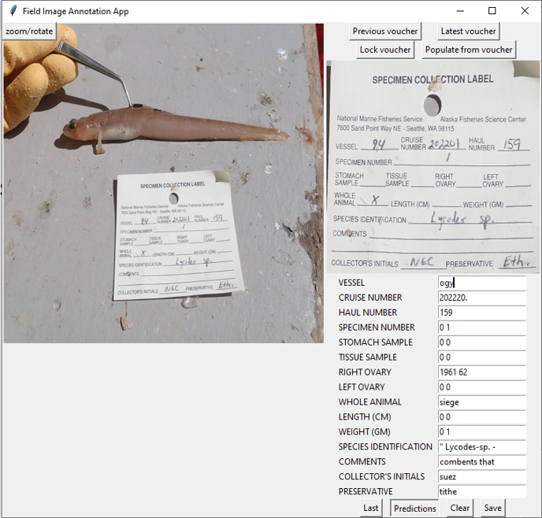

# RACE GAP form data extraction project

## 1. Project Overview & Problem Description
Information on specimen vouchers is maintained in the RACEBASE database, but the corresponding image paths are not associated with this metadata. This creates a disconnect where images cannot be referenced with a reliable lookup. The RACE/GAP dataset contains about 90k images collected over two decades. Specimen photographs are mixed with forms representing the specimen metadata, and these images are mixed in a roughly linear order throughout the dataset. 

Because this repository is unstructured, the forms provide rough waypoints for nearby specimen images but cannot be easily queried. This project implements a **tool-assisted machine learning approach** to extract structured form data from the imagery, allowing researchers to associate metadata with the specimen images.

**Key Challenges:**
* **Dataset inconsistency:** Images can contain a voucher, a specimen, both, or neither. They are also unreliably ordered and can jump between specimens.
* **Image quality:** Cameras have varying quality; imagery can be blurry with poor resolution (especially in older 2000s data).
* **Physical variations:** Forms appear at varying distances, angles, and lighting conditions. They are sometimes partially obscured, and no automatic rotation correction was natively present.
* **Handwriting:** Subject-specific messy handwriting makes off-the-shelf models struggle.
* **Advantage:** The underlying layout of the voucher form remains largely unchanged year over year, allowing for template-based extraction.

## 2. OCR Pipeline Implementation
Given the performance limitations of off-the-shelf handwriting recognition models, a fully automated pipeline was ruled out in favor of a robust tool-assisted application. The technical workflow includes:

* **Text Detection:** The pipeline uses `keras-ocr` to detect printed text on the voucher. If no text is detected initially, the system rotates the image and retries (up to 3 times) to find the form.
* **Form Alignment (Homography):** Detected text is mapped against an idealized form template using Levenshtein distance matching. Image processing (homography) is then used to re-project the voucher form to correct for orientation and lens distortion. (Note: the success of this step is highly dependent on how many printed form labels are correctly identified; earlier data suffers here).
* **Field Cropping & Handwriting Recognition:** Using the known dimensions of the aligned form, the pipeline crops individual data fields. These crops are then fed into a handwriting recognizer. After evaluating various modern models, **Microsoft's TROCR** was chosen as the best performer.
* **Image Association:** The pipeline attempts to associate cropped fields across consecutive vouchers using OpenCV (`calcHist`), though current performance in this area requires further improvement.
* **Outputs:** The pipeline generates a predictions table and saves the per-field training imagery for future model fine-tuning.

## 3. GUI App for Verification
Because fully automated handwriting transcription proved unreliable out-of-the-box, a simple graphical user interface (GUI) application was produced to keep a human in the loop. 
* **Tool-Assisted Verification:** The app displays the original cropped fields alongside the pipeline's OCR predictions, allowing users to efficiently verify and correct the transcribed text.
* **Training Data Generation:** Crucially, this tool-assisted verification simultaneously collects ground-truth training data. These human-verified labels are extremely valuable and will be used to fine-tune the handwriting classifier (TROCR), enabling more reliable predictions and a significant speedup in the future.

## 4. Next Steps & Protocol Recommendations
* **Future Data Collection:** Improvements can be made to field process for metadata integration at time of imagery data collection
* **Leverage Improving AI capabilities:** Leverage newer models and specific services (such as GCP document AI), and attempt rough classification of the species themselves with generic vision models.  

# Disclaimer

This repository is a scientific product and is not official communication of the National Oceanic and Atmospheric Administration, or the United States Department of Commerce. All NOAA GitHub project content is provided on an "as is" basis and the user assumes responsibility for its use. Any claims against the Department of Commerce or Department of Commerce bureaus stemming from the use of this GitHub project will be governed by all applicable Federal law. Any reference to specific commercial products, processes, or services by service mark, trademark, manufacturer, or otherwise, does not constitute or imply their endorsement, recommendation or favoring by the Department of Commerce. The Department of Commerce seal and logo, or the seal and logo of a DOC bureau, shall not be used in any manner to imply endorsement of any commercial product or activity by DOC or the United States Government.
